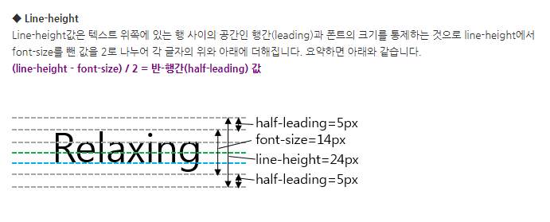

# CSS

[MDN CSS](https://developer.mozilla.org/en-US/docs/Web/CSS/Reference)

## Font

- [CSS Font Stack](https://www.cssfontstack.com/)

## Color

- [color Picker](https://htmlcolorcodes.com/color-picker/)
- [Color Names](https://htmlcolorcodes.com/color-names/)
- [Coolors](https://coolors.co/palettes/trending)

## Easing

- [Easings](https://easings.net/)

## Image

- [unsplash](https://unsplash.com/ko)

## [Line-height](https://velog.io/@ursr0706/line-height-%EC%86%8D%EC%84%B1)

